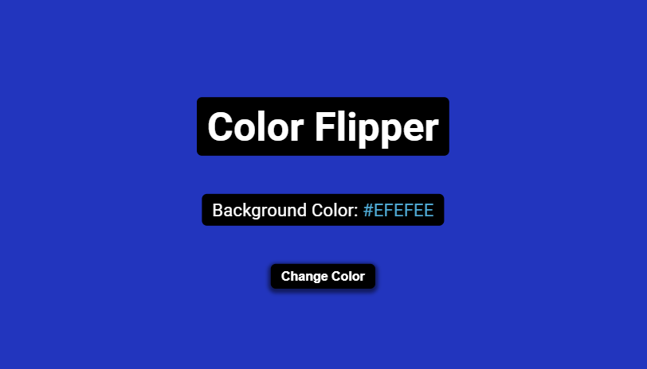

# Color Flipper

A small Vanilla JS project to get better at JavaScript DOM manipulation.

## Project Goal

---

- When clicked on the button background color changes with a random color generated on the fly.

## Live

You can check the project here. [▶ Color Flipper]().
